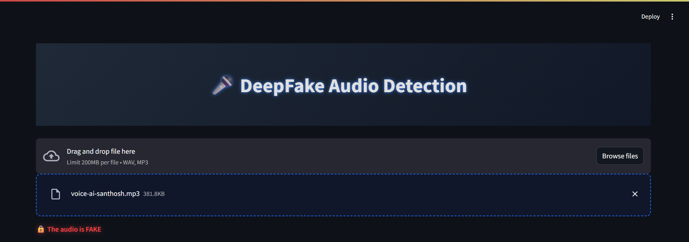
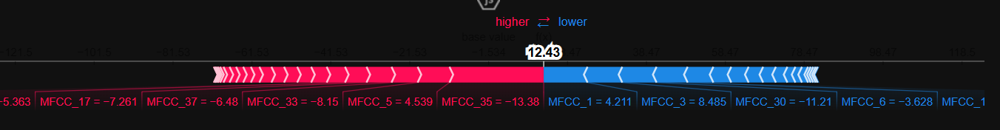
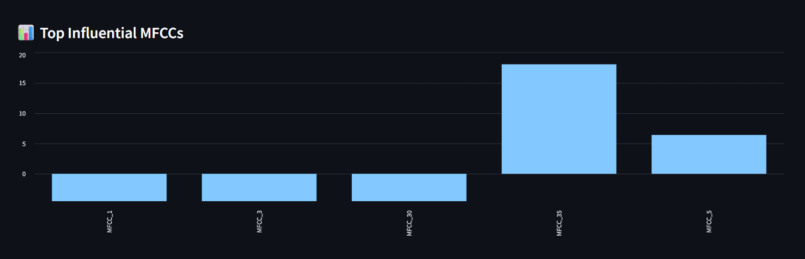
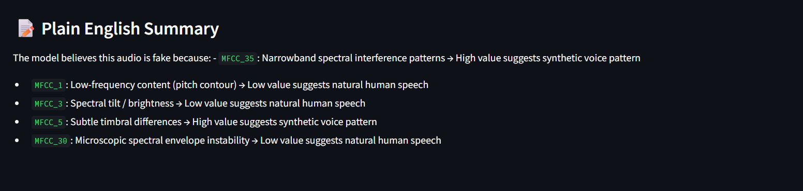

# 🎤 DeepShield – Audio Deepfake Detection System

🔍 A robust system to detect synthetic (deepfake) audio using CNN & Logistic Regression models, with SHAP-based explainability for transparency.

---

## 🧠 Overview

With the rise of AI-generated voice cloning and misinformation, detecting deepfake audio has become critical. **DeepShield** is an advanced audio deepfake detection tool that leverages machine learning and explainable AI techniques to ensure robust and transparent analysis.

It is designed to:

🎯 **Classify** whether an uploaded audio file is **real or fake**  
🧩 **Analyze audio in 10-second chunks** to catch even subtle deepfake segments — a single fake chunk flags the entire file  
📜 **Provide human-readable explanations** using SHAP values, so users can understand why a decision was made


## ✅ Features

- 🗣️ **Audio Upload**  
  Supports `.wav` and `.mp3` files

- ⏱️ **Chunked Analysis**  
  Splits long audios into 10-second chunks and flags the entire file if any segment is suspicious

- 🧮 **MFCC + Other Features**  
  Uses 40 MFCCs + Chroma STFT + Spectral Contrast + Tonnetz + ZCR + RMSE

- 🤖 **Dual Model Prediction**  
  Combines predictions from CNN and Logistic Regression models

- 📊 **SHAP Explainability**  
  Explains prediction decisions using SHAP values

- 💡 **Feature Meanings**  
  Each feature has a human-understandable description

- 🎨 **Streamlit UI**  
  User-friendly interface with styled visuals

- 🧾 **Plain English Summary**  
  Explains why an audio was flagged in simple terms

- 📈 **Interactive Force Plot**  
  Visualizes SHAP impact per feature

- 📊 **Bar Chart**  
  Shows top N most influential features

---

## 🛠️ Technologies Used

- **Python** – Core language  
- **Streamlit** – Frontend/UI framework  
- **TensorFlow/Keras** – CNN model building and inference  
- **scikit-learn** – Logistic Regression model and preprocessing  
- **librosa** – Audio processing and feature extraction  
- **pydub** – Audio splitting, trimming, normalization  
- **SHAP** – Model interpretability  
- **joblib / numpy** – Data handling and preprocessing  
- **FFmpeg** – Audio format conversion support

---

## 📁 Dataset Structure

This project uses a combination of:

- ✅ **Real human speech samples**  
- ❌ **Deepfake audio samples** generated using tools like **Voicebox**, **Tacotron**, and **StyleGAN**

🎧 **Used Dataset:**  
We used a custom-curated dataset combining samples from publicly available voice cloning repositories and synthetic datasets.

📦 **Download Dataset**:  
[🔗 https://www.kaggle.com/datasets/mohammedabdeldayem/the-fake-or-real-dataset] 

🧹 All audio files are preprocessed into consistent 10-second chunks and stored as NumPy arrays (`.npy`) or `.wav` files, ready for training.

---


## 🧪 How It Works

### 🔄 Step-by-Step Pipeline

1. **Upload Audio File** (`.wav` or `.mp3`)
2. **Audio Preprocessing**  
   - Trim silence  
   - Normalize volume  
   - Set consistent sample rate  
   - Pad or truncate to 10 seconds  
3. **Feature Extraction**  
   - MFCCs, Chroma, ZCR, RMSE, Spectral Contrast, Tonnetz  
4. **Prediction**  
   - Runs both CNN and Logistic Regression models  
   - If any chunk is fake → whole audio is flagged  
5. **Explainability**  
   - Uses SHAP to show which features/time frames were suspicious  
6. **User Feedback**  
   - Displays result + visual explanation + plain English summary

---

## 📋 Example Output

🔒 The audio is FAKE

Why?

MFCC_5: Subtle timbral differences → High value suggests synthetic voice pattern

MFCC_36: Inter-harmonic spacing variation → High value suggests unnatural modulation

MFCC_17: Rapid spectral slope fluctuations → Low value suggests natural speech

## 🚀 Installation

```bash
git clone https://github.com/yourusername/deepshield-audio-deepfake.git   
cd deepshield-audio-deepfake
pip install -r requirements.txt
```

## Running the app
```bash
streamlit run audio.py
```

### ⚠️ Note: Make sure to set the path to your local `ffmpeg.exe` for `pydub` to function correctly. Example:
```python
 from pydub import AudioSegment  
 AudioSegment.converter = "C:/ffmpeg/bin/ffmpeg.exe"
```


## 📚 Feature Dictionary

| Feature Group        | Count | Description                                         |
|----------------------|-------|-----------------------------------------------------|
| **MFCC**             | 40    | Loudness, Pitch, Formants, Harmonics               |
| **Chroma**           | 12    | Pitch class energy, prosody indicators             |
| **Spectral Contrast**| 7     | Peak vs valley energy across frequency bands       |
| **Tonnetz**          | 6     | Tonal structure and key clarity                    |
| **ZCR**              | 1     | Unvoiced or noisy segments                         |
| **RMSE**             | 1     | Short-term loudness patterns                       |

🔍 You can find the full mapping in the code under `mfcc_meanings`.

---

## 📷 Screenshots

- 
- 
- 
- 
---

## 📌 Future Enhancements (Optional)

- 📥 Add batch processing mode  
- 📼 Add video deepfake detection (multi-modal)  
- 📄 Export report (PDF/HTML)  
- 🌐 Deploy on Streamlit Cloud or Hugging Face Spaces  

---

## 🙌 Acknowledgements

- **Librosa** – Audio analysis library  
- **SHAP** – For model explainability  
- **Streamlit** – For rapid web UI development  
- **FFmpeg** – For audio conversion  

---

## 📬 Contact

If you have questions, want to contribute, or need help adapting this model:

- 📧 **Email**: santhoshbeeram19@gmail.com  

